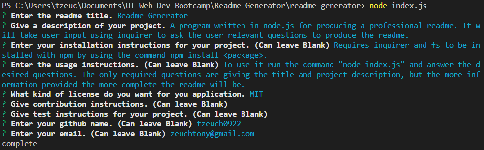
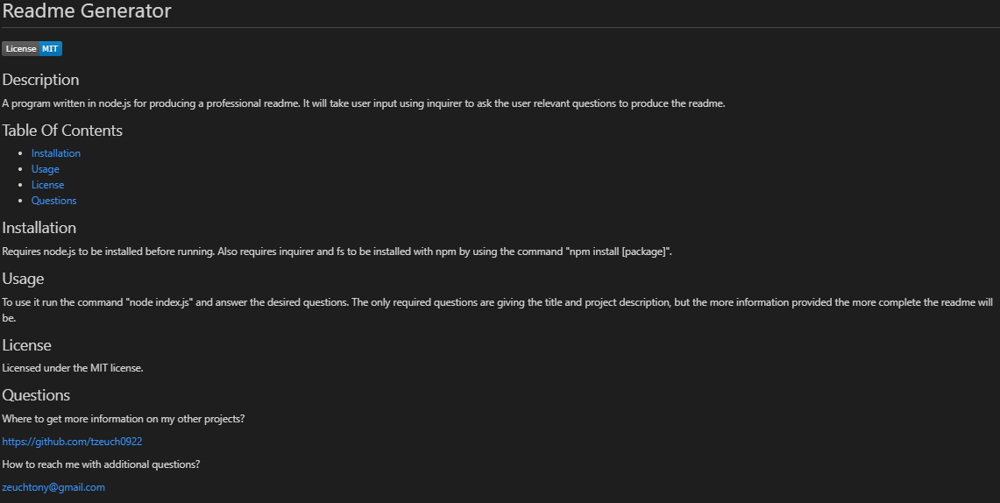

# Readme Generator

## Description
A program written in node.js for producing a professional readme. It will take user input using inquirer to ask the user relevant questions to produce the readme. The only required information is the title and description, but the readme will be more detailed if the user answers more of the questions. The generator will check to make sure that the title and description are given and won't continue otherwise. The generator won't generate information or headers for contents not given.

## Table Of Contents
* [Installation](#installation)
* [Usage](#usage)
* [License](#license)
* [Questions](#questions)
* [Screenshots](#screenshots)

## Installation
Requires node.js to be installed before running. Also requires inquirer and fs to be installed with npm by using the command "npm install [package]".

## Usage
To use it run the command "node index.js" and answer the desired questions. The only required questions are giving the title and project description, but the more information provided the more complete the readme will be.

## License
Licensed under the MIT license.

## Questions
Where to get more information on my other projects?

https://github.com/tzeuch0922

How to reach me with additional questions?

zeuchtony@gmail.com

## Screenshots
### Script Execution

### Script Output

## Demonstration Video
https://drive.google.com/file/d/1dw6oW4NnIHumqDjXmSzVlzDS5WEcFTcv/view